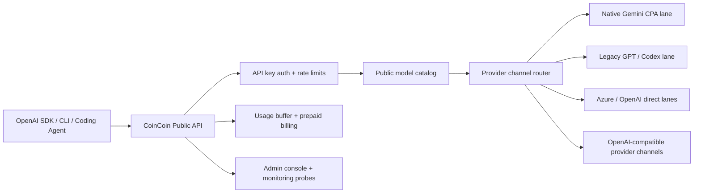

# CoinCoin Proxy

<p align="center">
  <strong>An OpenAI-compatible control plane for model routing, prepaid billing, usage governance, and admin operations.</strong>
</p>

<p align="center">
  <a href="./README.md">English</a>
  ·
  <a href="./README.zh-CN.md">简体中文</a>
</p>

<p align="center">
  
  
  
  
  
</p>

<p align="center">
  <a href="#official-cloud">Official Cloud</a>
  ·
  <a href="#sponsors">Sponsors</a>
  ·
  <a href="#quick-start">Quick Start</a>
  ·
  <a href="#api-examples">API Examples</a>
  ·
  <a href="#model-routing">Model Routing</a>
  ·
  <a href="./README.zh-CN.md">中文文档</a>
</p>

---

## Official Cloud

<p align="center">
  <a href="https://coincoin.ai">
    
  </a>
</p>

Want the hosted experience instead of running your own control plane? [CoinCoin.ai](https://coincoin.ai) is the official CoinCoin cloud gateway for Claude Code, Codex CLI, Gemini, cURL, and OpenAI-compatible SDKs.

New users get **$45 in starter credits** after registration, so you can test the public model catalog, unified billing, and coding-agent channels right away.

## Sponsors

CoinCoin Proxy is made possible by sponsors from university alumni communities, technology companies, and overseas Chinese builder networks. Thank you for backing the project and helping keep the public API experience stable, affordable, and developer-friendly.

| Sponsor | Thank you |
| --- | --- |
| <a href="https://www.reading.ac.uk/alumni/community/reading-alumni-groups/china"></a><br><strong>University of Reading</strong><br><sub>Chinese Alumni Association</sub> | Huge thanks to the [University of Reading China alumni community](https://www.reading.ac.uk/alumni/community/reading-alumni-groups/china) for sponsoring this project. Your support helps CoinCoin keep improving its OpenAI-compatible control plane, public model catalog, and documentation for Chinese-speaking builders. |
| <br><strong>Hailv PLUS</strong><br><sub>海归 PLUS</sub> | Thanks to **Hailv PLUS** for sponsoring CoinCoin Proxy and supporting overseas Chinese developers, founders, and returning-student communities. Hailv PLUS helps connect internationally educated builders with practical resources, peer networks, and launch support. |
| <a href="https://wrexham.ac.uk/alumni/"></a><br><strong>Wrexham Glyndwr University</strong><br><sub>Wrexham University</sub> | Thanks to the [Wrexham University Alumni Association](https://wrexham.ac.uk/alumni/) for supporting the project. Their backing helps us keep the gateway approachable for students, alumni teams, and early-stage technical communities building with AI APIs. |
| <a href="https://www.nio.com/en_US"></a><br><strong>NIO</strong><br><sub>Technology sponsor</sub> | Huge thanks to [NIO](https://www.nio.com/en_US) for sponsoring this project. NIO's support reflects a shared belief in developer infrastructure, intelligent systems, and practical tools that help teams ship faster. |
| <a href="https://www.york.ac.uk/alumni/"></a><br><strong>University of York</strong><br><sub>Alumni community</sub> | Thanks to the [University of York alumni community](https://www.york.ac.uk/alumni/) for sponsoring this project and supporting practical AI tooling for graduates, student builders, and independent teams. |
| <br><strong>EAU</strong><br><sub>European Alumni Union / 欧洲校友会联合会</sub> | Thanks to **EAU, the European Alumni Union**, for sponsoring CoinCoin Proxy and supporting cross-border alumni collaboration. Your support helps keep the project useful for distributed communities that build, learn, and operate across regions. |
| <a href="https://uom.ac.cn/alumni/committee"></a><br><strong>The University of Manchester</strong><br><sub>China Alumni Association</sub> | Huge thanks to the [University of Manchester China alumni community](https://uom.ac.cn/alumni/committee) for sponsoring the project. Your support helps CoinCoin keep improving the developer experience for Chinese alumni builders and AI product teams. |

## What Is CoinCoin Proxy?

CoinCoin Proxy is the public control plane for an OpenAI-compatible API business.
It sits between users and upstream model providers, then handles the boring but essential work:

- API key lifecycle and user activation
- prepaid balance and token usage accounting
- public model catalog governance
- OpenAI-compatible chat, embeddings, image generation, and image editing endpoints
- provider channel routing, weighted traffic, cooldowns, and fallback
- admin console workflows for users, channels, billing, monitoring, and support

End users only talk to CoinCoin's public API and public model names. Internal gateways, native Gemini CPA lanes, legacy GPT lanes, Azure/OpenAI routes, and provider-specific model IDs stay behind the control plane.

## Why Teams Use It

| Capability | What it gives you |
| --- | --- |
| OpenAI-compatible API | Users can keep their OpenAI SDK, CLI tool, or coding agent configuration. |
| Public model catalog | Expose stable aliases like `gpt-5.2-codex`, `gemini-fast`, and `gemini-image` without leaking internal provider names. |
| Prepaid billing | Track input tokens, output tokens, images, jobs, balance, and per-request cost in one system. |
| Provider routing | Add OpenAI-compatible upstream channels, route public models to them, and fail over when a channel cools down. |
| Image workflows | Serve synchronous generation/editing plus async generation and multi-image editing jobs. |
| Admin operations | Manage users, keys, usage, recharge records, model routes, channel health, and monitoring probes. |

Optional durable usage/quota infrastructure is available through Redis Streams
and the Go `usage-quota-service`. It is disabled by default; the Python gateway
remains the canonical billing path until shadow reconciliation proves parity.
See [`docs/usage-quota-infra.md`](./docs/usage-quota-infra.md).

## Core Features

- **Chat Completions compatibility**: `/v1/chat/completions` with streaming, tools, function calling, and OpenAI-shaped responses.
- **Embeddings**: `/v1/embeddings` with the public `text-embedding-3-small` alias.
- **Image generation and editing**: `/v1/images/generations`, `/v1/images/edits`, and async `/v1/image-jobs/generations` and `/v1/image-jobs/edits`.
- **Slow image connection protection**: synchronous image JSON responses emit JSON-safe whitespace heartbeats so idle network intermediaries can keep the connection open while the upstream finishes.
- **Usage accounting**: input/output token units, image units, job costs, balance, and request history.
- **Provider channels**: admin-managed OpenAI-compatible upstream URLs and keys.
- **Route fallback**: priority, weight, cooldown, failure thresholds, and system fallback back to catalog defaults.
- **Monitoring probes**: admin-only protected endpoints for Checkly or internal operations.
- **Station workflows**: reseller/station center support for downstream users and settlement metadata.

## Architecture



The public contract is intentionally stable: users see CoinCoin API keys and CoinCoin model aliases. Operators can change upstream providers, model routes, fallback priority, or pricing without rewriting every client integration.

## Quick Start

### 1. Install

```bash
git clone https://github.com/hezhaoqian1/coincoin-proxy.git
cd coincoin-proxy
pip install -r requirements.txt
```

### 2. Configure

```bash
cp env.example .env
```

Set the minimum local variables:

```env
COINCOIN_ADMIN_TOKEN=change-me
COINCOIN_UPSTREAM_BASE_URL=https://your-azure-openai.example.com/openai/v1
COINCOIN_UPSTREAM_API_KEY=your-azure-api-key
COINCOIN_FIXED_MODEL=gpt-5.2-codex

COINCOIN_DB_HOST=localhost
COINCOIN_DB_PORT=3306
COINCOIN_DB_NAME=coincoin
COINCOIN_DB_USER=root
COINCOIN_DB_PASSWORD=your-db-password
```

Optional production lanes can be added with the variables in [`env.example`](./env.example):

- native Gemini text and images
- OpenAI/Azure image generation
- Seedance video generation
- provider channel active monitoring
- Checkly-style protected probes

Synchronous image requests use a 15-second JSON whitespace keepalive by default. Set
`COINCOIN_IMAGE_NONSTREAM_KEEPALIVE_INTERVAL_SECONDS=0` to disable it. Once the
first heartbeat is sent, HTTP status is committed as `200`; a later upstream failure
is returned in the final OpenAI-compatible JSON error body. Use the async image-job
endpoints when clients require short requests or authoritative late HTTP statuses.
Heartbeats do not override a client's own total timeout. Async jobs split one long
request into a short create request plus polling requests; they do not make the
upstream generate the image faster.

### 3. Run

```bash
uvicorn app.main:app --reload --port 8000
```

Open:

- API health: `http://127.0.0.1:8000/health`
- Public API docs: `http://127.0.0.1:8000/docs`
- Admin console: `http://127.0.0.1:8000/admin/ui?token=<admin-token>`

## API Examples

The hosted [image guide](https://coincoin.ai/guides/images) provides ready-to-run
macOS/Linux and Windows PowerShell scripts for generation, editing, polling, and
image-file download.

### Chat Completions

```bash
curl http://127.0.0.1:8000/v1/chat/completions \
  -H "Authorization: Bearer sk_cc_xxx" \
  -H "Content-Type: application/json" \
  -d '{
    "model": "gemini-fast",
    "messages": [
      {"role": "system", "content": "You are a helpful assistant."},
      {"role": "user", "content": "Give me a concise launch checklist."}
    ],
    "stream": false
  }'
```

### Embeddings

```bash
curl http://127.0.0.1:8000/v1/embeddings \
  -H "Authorization: Bearer sk_cc_xxx" \
  -H "Content-Type: application/json" \
  -d '{
    "model": "text-embedding-3-small",
    "input": "memory chunk to index"
  }'
```

### Image Editing

```bash
curl http://127.0.0.1:8000/v1/images/edits \
  -H "Authorization: Bearer sk_cc_xxx" \
  -F "model=gemini-image" \
  -F "prompt=Turn this into a clean pixel-art icon" \
  -F "n=1" \
  -F "size=1024x1024" \
  -F "image=@./input.png"
```

For image requests, `size` is a target. Common OpenAI-compatible values are
`1024x1024`, `1536x1024`, `1024x1536`, and `auto` when the selected upstream
supports them. `1K`, `2K`, and `4K` are not universal compatibility values, and
the final file dimensions are determined by the upstream. Responses may contain
either `b64_json` or a temporary `url`; URL downloads should follow redirects,
for example with `curl -L`.

### Async Image Generation

```bash
curl http://127.0.0.1:8000/v1/image-jobs/generations \
  -H "Authorization: Bearer sk_cc_xxx" \
  -H "Content-Type: application/json" \
  -d '{
    "model": "gpt-image-2",
    "prompt": "A blue coin mascot on a white background",
    "size": "1024x1024",
    "n": 1
  }'
```

### Async Multi-Image Editing

```bash
curl http://127.0.0.1:8000/v1/image-jobs/edits \
  -H "Authorization: Bearer sk_cc_xxx" \
  -F "model=gemini-image" \
  -F "prompt=Combine these references into one cohesive poster illustration" \
  -F "n=1" \
  -F "size=1024x1024" \
  -F "image=@./input-1.png" \
  -F "image=@./input-2.png" \
  -F "image=@./input-3.png"
```

Then poll:

```bash
curl http://127.0.0.1:8000/v1/image-jobs/<job_id> \
  -H "Authorization: Bearer sk_cc_xxx"
```

## Public Endpoints

| Endpoint | Method | Description |
| --- | --- | --- |
| `/health` | `GET` | Health check |
| `/v1/models` | `GET` | Public model catalog |
| `/v1/models/{model_id}` | `GET` | Single public model record |
| `/v1/chat/completions` | `POST` | OpenAI-compatible chat completions |
| `/v1/embeddings` | `POST` | Embeddings with `text-embedding-3-small` |
| `/v1/images/generations` | `POST` | Image generation |
| `/v1/images/edits` | `POST` | Image editing and image-to-image |
| `/v1/image-jobs/generations` | `POST` | Async image generation job |
| `/v1/image-jobs/edits` | `POST` | Async multi-image edit job |
| `/v1/image-jobs/{job_id}` | `GET` | Async job status and result |
| `/v1/balance` | `GET` | User balance and aggregate usage |
| `/v1/usage` | `GET` | Paginated request history |

## Model Routing

CoinCoin's public model catalog lives in [`config/model_catalog.json`](./config/model_catalog.json).

Routing rules:

- If a user omits `model`, the default GPT public model still works for legacy clients.
- Image generation defaults to `gpt-image-2` unless the request selects a different public image alias.
- Gemini text aliases route through the native Gemini CPA lane.
- `gemini-image` routes through CoinCoin's OpenAI-compatible image adapter.
- Embeddings use `text-embedding-3-small` and do not share the old GPT/CPA lane.
- Admin-created provider channel routes can override catalog defaults for specific public models and endpoints.
- If a provider channel fails, CoinCoin records the failure, applies cooldown rules, tries one alternate route when available, and then falls back to the system catalog path.
- Claude Code-only upstreams use Anthropic-compatible provider channels plus route-only public Claude models; see [`docs/architecture/claude-code-upstream-runbook.md`](./docs/architecture/claude-code-upstream-runbook.md) for the Sixoner route, Sonnet 5, pricing multiplier, and monitoring caveats.

For the full operator workflow, see the Chinese runbook in [`README.zh-CN.md`](./README.zh-CN.md#上游渠道模型-route-与-fallback).

## Admin Console

The admin console is available at:

```text
/admin/ui?token=<admin-token>
```

Common admin workflows:

- create and disable user keys
- inspect usage and balances
- add provider channels
- create model routes
- choose one representative probe target per provider channel automatically or from its active routes
- inspect channel probe health separately from public-model route coverage, real traffic, and fallback activity
- review recharge records
- run protected monitoring probes

## Testing

Backend unit tests:

```bash
env \
  PYTHONPATH=. \
  PYTHONPYCACHEPREFIX=/tmp/pycache \
  COINCOIN_DB_HOST=localhost \
  COINCOIN_DB_NAME=test \
  COINCOIN_DB_USER=test \
  COINCOIN_DB_PASSWORD=test \
  python3 -m unittest discover -s tests -p 'test_*.py'
```

Frontend build:

```bash
cd coincoin-web
npm run build
```

## Documentation

- [简体中文 README](./README.zh-CN.md)
- [Environment example](./env.example)
- [Model catalog](./config/model_catalog.json)
- [Aegis operating notes](./docs/aegis/README.md)

The broader workspace has additional operations documentation, but this repository is the deployed public control plane. Public user-facing API behavior should be updated here first.

## Open Source Boundary

This repository can be presented publicly as the CoinCoin control plane. Keep these out of public commits:

- `.env` and any deployment secrets
- real API keys, bearer tokens, refresh tokens, admin tokens, or database passwords
- private customer delivery docs
- real provider account files
- local virtual environments, generated static builds, and agent/browser state

## Contributing

Issues, bug reports, integration notes, and compatibility fixes are welcome. For model catalog or routing changes, update the catalog, tests, and operator notes together so public aliases remain predictable.

## License

CoinCoin Proxy is released under the [MIT License](./LICENSE).
