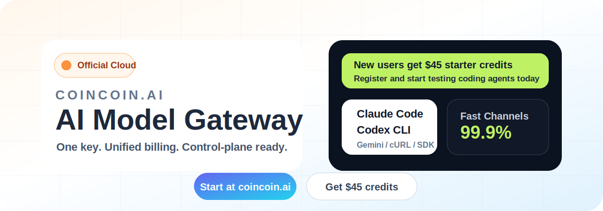

# CoinCoin Proxy

<p align="center">
  <a href="./README.md">English</a>
  ·
  <a href="./README.zh-CN.md">简体中文</a>
</p>

<p align="center">
  <a href="#官方云服务">官方云服务</a>
  ·
  <a href="#赞助方">赞助方</a>
  ·
  <a href="#快速开始">快速开始</a>
  ·
  <a href="#模型兼容规则">模型兼容规则</a>
  ·
  <a href="./README.md">English README</a>
</p>

> 这是 CoinCoin Proxy 的完整中文说明。英文首页用于 GitHub 开源展示和快速浏览。

OpenAI 兼容的 API 控制平面，负责客户密钥、余额、用量控制和公开模型目录。当前长期架构里，旧 GPT/Codex 继续走 legacy lane，Gemini 文本和图片走 CoinCoin 内置的 native Gemini CPA lane，不再把 LiteLLM 作为正式 Gemini 数据面。

## 官方云服务

<p align="center">
  <a href="https://coincoin.ai">
    
  </a>
</p>

如果你不想自己部署控制面，可以直接使用官方云服务 [CoinCoin.ai](https://coincoin.ai)。它面向 Claude Code、Codex CLI、Gemini、cURL 和 OpenAI-compatible SDK，提供统一 Key、统一计费和公开模型目录。

新用户注册即可获得 **$45 美金额度**，可以马上测试模型网关、计费控制和 coding-agent 通道。

## 赞助方

CoinCoin Proxy 感谢来自大学校友会、科技公司和海外华人开发者网络的赞助支持。你们的支持让这个 OpenAI 兼容控制面能持续打磨公开模型目录、计费治理、文档和开发者体验。

| 赞助方 | 致谢 |
| --- | --- |
| <a href="https://www.reading.ac.uk/alumni/community/reading-alumni-groups/china"></a><br><strong>University of Reading</strong><br><sub>Chinese Alumni Association</sub> | 感谢 [University of Reading China alumni community](https://www.reading.ac.uk/alumni/community/reading-alumni-groups/china) 赞助 CoinCoin Proxy，支持我们继续完善 OpenAI 兼容控制面、公开模型目录和面向中文开发者的文档。 |
| <br><strong>Hailv PLUS</strong><br><sub>海归 PLUS</sub> | 感谢 **Hailv PLUS** 赞助 CoinCoin Proxy，并支持海外华人开发者、创业者与归国留学生社区。Hailv PLUS 帮助连接国际化背景的建设者、实践资源、同伴网络和启动支持。 |
| <a href="https://wrexham.ac.uk/alumni/"></a><br><strong>Wrexham Glyndwr University</strong><br><sub>Wrexham University</sub> | 感谢 [Wrexham University Alumni Association](https://wrexham.ac.uk/alumni/) 支持本项目。你们的赞助帮助我们让网关能力更适合学生、校友团队和早期技术社区使用。 |
| <a href="https://www.nio.com/en_US"></a><br><strong>NIO</strong><br><sub>Technology sponsor</sub> | 感谢 [NIO](https://www.nio.com/en_US) 赞助本项目。NIO 的支持体现了对开发者基础设施、智能系统和实用工具的共同信念。 |
| <a href="https://www.york.ac.uk/alumni/"></a><br><strong>University of York</strong><br><sub>Alumni community</sub> | 感谢 [University of York alumni community](https://www.york.ac.uk/alumni/) 赞助本项目，并支持面向毕业生、学生开发者和独立团队的实用 AI 工具。 |
| <br><strong>EAU</strong><br><sub>European Alumni Union / 欧洲校友会联合会</sub> | 感谢 **EAU, the European Alumni Union** 赞助 CoinCoin Proxy，并支持跨区域校友协作。你们的支持让项目更好服务分布式社区的构建、学习与运营。 |
| <a href="https://uom.ac.cn/alumni/committee"></a><br><strong>The University of Manchester</strong><br><sub>China Alumni Association</sub> | 感谢 [University of Manchester China alumni community](https://uom.ac.cn/alumni/committee) 赞助本项目。你们的支持帮助 CoinCoin 持续改善中文校友开发者和 AI 产品团队的使用体验。 |

## 功能特性

- **OpenAI 兼容** - 完全兼容 OpenAI Chat Completions API 格式
- **公开模型目录** - `/v1/models` 暴露受控模型别名而不是单一固定模型
- **Tools/Function Calling** - 支持工具调用，自动转换格式
- **Embeddings** - 支持 `/v1/embeddings`，并固定走 Azure `text-embedding-3-small`
- **用户管理** - 多用户 API Key 管理
- **余额计费** - 支持按 Input/Output Token 分别计费，实时扣费
- **永久美金额度** - 新购买额度永久有效、可叠加，不再绑定月卡周期
- **图片能力** - 支持同步文生图/图生图、异步文生图和 Gemini 多图异步编辑，并为图片请求记录独立 usage unit
- **用量统计** - 分项统计 Input/Output Token 和消费金额
- **限流控制** - 支持每分钟/每日请求限制
- **管理后台** - Web UI 管理界面
- **上游渠道分发** - 管理员可在后台接入多个 OpenAI-compatible 上游 URL/Key，并按公开模型配置优先级、权重、fallback 和渠道监控
- **充值接口** - Webhook 充值，支持余额和 Token 额度

可选的持久用量/额度基础设施已经放在 Redis Streams 和 Go
`usage-quota-service` 中，默认关闭。正式账务路径仍由 Python 网关负责，直到
shadow reconciliation 证明与历史请求日志和日聚合完全一致。开关、运行命令和回滚步骤见
[`docs/usage-quota-infra.md`](./docs/usage-quota-infra.md)。

### 美金额度购买与历史权益

新的支付页面只售卖三档永久美金额度：

| 支付金额 | 到账美金额度 | 有效期 |
| --- | ---: | --- |
| ¥59.90 | $100 | 永久有效 |
| ¥199 | $400 | 永久有效 |
| ¥399 | $1,000 | 永久有效 |

- 新购买的美金额度没有月卡周期，可重复购买并自动叠加。
- 已经付费的老月卡继续按原 `paid_until` 和 30 天周期使用，到期后不再售卖或续费。
- 已有且仍有效的历史流量包继续可用，不再要求月卡处于有效状态；到期或用完后不再售卖。
- 扣费顺序为：有效老月卡、有效历史流量包、永久美金额度、尚未迁移的历史余额。
- `scripts/migrate_legacy_credits.py` 默认只做 dry-run。生产迁移必须先完成对账，并显式使用受限的 `--apply`；正常部署不会自动迁移或删除历史账务数据。

---

## 快速开始

完整环境变量说明与价格变量说明，优先看本仓库文件：

- [env.example](./env.example)
- [config/model_catalog.json](./config/model_catalog.json)

### 1. 安装依赖

```bash
cd coincoin-proxy
pip install -r requirements.txt
```

### 2. 配置环境变量

复制示例配置并修改：

```bash
cp env.example .env
```

编辑 `.env` 文件：

```env
# Admin Token (用于管理后台)
COINCOIN_ADMIN_TOKEN=your-admin-token

# Monitoring / Checkly（管理员 / 运维专用，不做终端用户状态页）
COINCOIN_MONITORING_TOKEN=your-monitoring-token
COINCOIN_MONITORING_API_KEY=your-low-cost-monitoring-key
COINCOIN_MONITORING_PUBLIC_BASE_URL=https://your-public-coincoin-domain
COINCOIN_MONITORING_GATEWAY_HEALTH_URL=https://your-private-gateway-health-url
COINCOIN_MONITORING_CHAT_MODEL=gpt-5.2-codex
COINCOIN_MONITORING_RESPONSES_MODEL=gpt-5.2-codex

# 可选：CPA / legacy GPT-Codex lane 直连监控（绕过 CoinCoin 公网控制面）
COINCOIN_MONITORING_CPA_BASE_URL=https://your-cpa-domain
COINCOIN_MONITORING_CPA_API_KEY=your-cpa-monitoring-key
COINCOIN_MONITORING_CPA_CHAT_MODEL=gpt-5.2-codex
COINCOIN_MONITORING_CPA_RESPONSES_MODEL=gpt-5.2-codex

# Provider Channel 主动监控（管理员后台用）
COINCOIN_PROVIDER_CHANNEL_MONITOR_ENABLED=true
COINCOIN_PROVIDER_CHANNEL_MONITOR_POLL_INTERVAL=15
COINCOIN_PROVIDER_CHANNEL_MONITOR_DEFAULT_INTERVAL=300
COINCOIN_PROVIDER_CHANNEL_MONITOR_DEFAULT_TIMEOUT=30
COINCOIN_PROVIDER_CHANNEL_MONITOR_HISTORY_RETENTION_DAYS=35

# 旧 GPT 链路（默认公共模型）
COINCOIN_UPSTREAM_BASE_URL=https://your-instance.cognitiveservices.azure.com/openai/v1
COINCOIN_UPSTREAM_API_KEY=your-azure-api-key
COINCOIN_FIXED_MODEL=gpt-5.2-codex
COINCOIN_EMBEDDING_MODEL=text-embedding-3-small
COINCOIN_MODEL_CATALOG_PATH=config/model_catalog.json

# Native Gemini CPA lane（Gemini text + Gemini images）
# 注意：这是 Gemini CPA 项目，不是 Codex/GPT CPA 项目；catalog 会自动补 /v1
COINCOIN_GEMINI_CPA_BASE_URL=https://gemini-c.up.railway.app
COINCOIN_GEMINI_CPA_API_KEY=your-gemini-cpa-key
COINCOIN_GEMINI_CPA_AUTH_STYLE=bearer
COINCOIN_GEMINI_CPA_ALLOWED_FAILS=3
COINCOIN_GEMINI_CPA_COOLDOWN_SECONDS=30

# 可选：直连 Vertex 调试 / fallback
# 不是公网 Gemini 主链路的必需项
COINCOIN_VERTEX_API_KEY=your-vertex-api-key
COINCOIN_VERTEX_GEMINI_API_BASE=https://aiplatform.googleapis.com/v1/publishers/google

# 多图异步任务
COINCOIN_IMAGE_JOBS_ENABLED=true
COINCOIN_IMAGE_JOB_SYNC_INPUT_LIMIT=2
COINCOIN_IMAGE_JOB_ASYNC_MAX_INPUTS=8
COINCOIN_IMAGE_JOB_MAX_TOTAL_BYTES=52428800

# 同步图片 JSON 保活；每 15 秒发送 JSON 合法空白，0 表示关闭
COINCOIN_IMAGE_NONSTREAM_KEEPALIVE_INTERVAL_SECONDS=15

# 数据库配置 (MySQL/TiDB)
COINCOIN_DB_HOST=localhost
COINCOIN_DB_PORT=3306
COINCOIN_DB_NAME=coincoin
COINCOIN_DB_USER=root
COINCOIN_DB_PASSWORD=password

# 计费配置（可选）
COINCOIN_PRICE_INPUT_PER_MILLION=99     # Input 价格: 99 分/百万tokens = $0.99/M
COINCOIN_PRICE_OUTPUT_PER_MILLION=699   # Output 价格: 699 分/百万tokens = $6.99/M
COINCOIN_BILLING_MODE=balance           # 计费模式: balance(余额) / token_limit(额度) / none(不限制)

# Gemini 计费（可选；不填时使用 config/model_catalog.json 里的默认价格）
COINCOIN_GEMINI_BALANCED_INPUT_PRICE=10
COINCOIN_GEMINI_BALANCED_OUTPUT_PRICE=40
COINCOIN_GEMINI_FAST_INPUT_PRICE=30
COINCOIN_GEMINI_FAST_OUTPUT_PRICE=250
COINCOIN_GEMINI_REASONING_INPUT_PRICE=125
COINCOIN_GEMINI_REASONING_OUTPUT_PRICE=1000
COINCOIN_GEMINI_IMAGE_PRICE=6.7

# Webhook 密钥（用于充值接口）
COINCOIN_WEBHOOK_SECRET=your-webhook-secret
```

### 3. 启动服务

```bash
uvicorn app.main:app --host 0.0.0.0 --port 8000
```

或使用 reload 模式开发：

```bash
uvicorn app.main:app --reload --port 8000
```

## 模型兼容规则

- 终端客户只看 CoinCoin 的公开模型目录，不直接感知 Gemini CPA、LiteLLM 或 Vertex 的内部模型名
- 老用户如果不传 `model`，仍然走默认 GPT 公共模型
- 旧 GPT lane 当前公开 alias 包括 `gpt-5`、`gpt-5.1`、`gpt-5.1-codex`、`gpt-5.1-codex-mini`、`gpt-5.1-codex-max`、`gpt-5.2`、`gpt-5.2-codex`、`gpt-5.3-codex`、`gpt-5.4`、`gpt-5.4-mini`、`gpt-5.5`、`gpt-5.6`、`gpt-5.6-sol`、`gpt-5.6-terra`、`gpt-5.6-luna`、`codex-auto-review`、`gpt-5-codex`、`gpt-5-codex-mini`，以及由 `COINCOIN_FIXED_MODEL` 指定的默认 GPT alias
- embedding 请求不再复用旧 GPT / CPA lane；`/v1/embeddings` 默认和显式 `text-embedding-3-small` 都直连 Azure
- Gemini 文本能力是增量暴露；显式传入 Gemini 文本 alias 时，会路由到 native Gemini CPA lane
- 图片请求如果省略 `model`，默认走 `gpt-image-2` 的 OpenAI/Azure 图片直连 lane
- Gemini 图片 alias 保留为显式模型；传入 `model=gemini-image` 时，会路由到 native Gemini CPA lane，并在 CoinCoin 内转换成 OpenAI-compatible 图片响应
- 图片模型支持 `/v1/images/generations` 与 `/v1/images/edits`，不会伪装成文本模型
- 同步图片请求默认每 15 秒发送一次 JSON 合法空白，降低上游生成期间因连接长期无数据而被网络中间层断开的概率；空白不会影响最终 JSON 解析
- 保活只能处理空闲连接，不能覆盖客户端自身的总超时；客户端或网络链路有约 120 秒总超时时，使用异步图片任务把一条长连接拆成创建和轮询多个短请求
- 第一次保活写出后 HTTP 状态会固定为 `200`，晚到的上游错误通过最终 OpenAI-compatible JSON error body 表达；需要严格错误状态时也应使用异步图片任务
- 图片 `size` 是目标尺寸，常用兼容值为 `1024x1024`、`1536x1024`、`1024x1536` 或 `auto`；`1K`、`2K`、`4K` 不是通用兼容值，最终像素以上游实际文件为准
- `<=2` 张输入图继续走同步 `/v1/images/edits`
- `>=3` 张输入图使用显式异步 job 端点，避免把大图任务强塞进同步公开契约
- Seedance 视频模型支持 `/v1/videos/generations`，创建后按 `job_id` 查询；不传 `model` 时使用默认视频模型
- Seedance 纯文本视频请求会被拒绝，必须提供图片、首帧/尾帧、视频或音频参考；视频/音频参考需要 `-video` 后缀模型
- Seedance 默认价格按 wgspai 上游合同的单次任务价配置，不按 BytePlus 公开 M tokens 价格直接展示
- 分站 alias / pricebook 暂不开放视频模型；视频只走主站公开 `/v1/videos/generations`
- 公开目录的 source of truth 是 `config/model_catalog.json`
- 后续扩模型时，同步修改 CoinCoin catalog、native Gemini CPA channel metadata、测试与文档
- 每次发布后都要跑本 README 中的本地验证命令，并按实际部署环境做接口验收

## 上游渠道、模型 route 与 fallback

后台入口：

- 打开 `/admin/ui?token=<admin-token>`
- 左侧进入 `管理 -> 上游渠道`

这块是管理员可控的运行时分发层，终端用户仍然只看到 CoinCoin 的公共 API、公共模型名和自己的 CoinCoin Key。

### 页面区块

- `系统默认渠道`：只读展示当前 catalog/env 产生的默认路径，包括 Gemini CPA、legacy GPT/Codex CPA、OpenAI/Azure 直连和其它 catalog direct route。这些路径保留为默认和系统 fallback，不会因为新增 provider channel 而退役。
- `Provider Channels`：新增或编辑外部上游 URL/Key，例如 Sub2API、New API、其它 OpenAI-compatible 网关；已有渠道还可以从活跃 route 中自动或手动选择一个代表监测模型。
- `Model Routes`：把一个 CoinCoin 公开模型映射到某个 provider channel 的上游模型。只有建了 route 的公开模型才会被后台渠道覆盖。
- `服务可靠性`：先展示渠道的代表探测、真实流量、fallback 和路由冷却，再单独展示公开模型的 route 覆盖与真实流量；公开模型状态不会继承代表探测结果。
- `代表探测`：每个 provider channel 最多执行一个代表模型探测。自动模式按有效 priority、weight 和 route 顺序选取目标；管理员也可以在渠道编辑弹窗中选择精确的模型和 endpoint，或重置为自动。

### 接入一个新 URL/Key

1. 在 `Provider Channels` 点 `新增渠道`。
2. `Base URL` 建议填 OpenAI-compatible 根路径，例如 `https://<provider-domain>/v1`。如果只填根域名，后台的模型发现会提示建议的 `/v1` 地址。
3. `API Key` 填该上游给你的 key，认证通常选 `Bearer`。
4. `优先级 priority` 数字越小越先用；`权重 weight` 只在同优先级候选里生效。
5. `失败阈值 allowed_fails` 达到后进入冷却；`冷却秒数 cooldown_seconds` 控制暂时跳过这个渠道多久。
6. 保存后点 `测试` 或 `模型`，确认 `/v1/models` 能返回模型列表。
7. 在模型列表里对目标模型点 `建 route`，选择要覆盖的 CoinCoin 公开模型。
8. route 生效后重新编辑渠道；`监测模型` 默认使用自动选择，也可以固定到该渠道的一条活跃文本 route。探测会发送一次最小非流式生成请求，只更新渠道监测结果，不修改 route、priority、weight、fallback 或冷却状态。

### Route 语义

- 没有 route 时，请求继续走 `config/model_catalog.json` 和 env 的默认路径。
- 有 route 且公开模型/endpoint 命中时，请求先走该 provider channel。
- `Endpoint=全部` 表示该公开模型的相关能力都可以命中；填 `responses` 或 `chat/completions` 则只覆盖单个接口。
- `upstream_model` 是该渠道真正收到的模型名；`public_model_id` 是用户请求里看到的 CoinCoin 模型名。
- route 上的 priority/weight override 优先于渠道默认值；为空时继承渠道配置。

### 调度和 fallback

- priority 小的渠道优先。
- 同 priority 时按 weight 加权随机，例如 `weight 9` 与 `weight 1` 约等于 90%/10% 分流，不保证每 10 次严格固定。
- 单次请求的 provider channel 尝试上限是两个：主渠道失败后，会排除已尝试渠道，再找一个同模型的 active route。
- 如果没有可用备用渠道，或第二个渠道也失败，会进入系统 fallback，回到 catalog/env 默认路径；legacy GPT/Codex 模型会回到 CPA/account pool，Gemini alias 回到 native Gemini CPA，直连 alias 回到 catalog direct route。
- `408`、`409`、`429`、`5xx` 和上游连接/超时/空响应等错误会触发渠道失败记录和 fallback 逻辑。
- `allowed_fails` 达到阈值后，该渠道进入冷却；管理员可在后台点 `清冷却` 手动恢复调度。

### 日志与验收

管理员排障时优先看请求日志和上游渠道页：

- `channel_id`：实际执行渠道
- `channel_type`：例如 `openai_compatible` 或 `account_pool`
- `provider_platform`：例如 `sub2api`、`legacy_cpa`、`cpa_gemini`
- `provider_account_fingerprint`：上游账号指纹，不要写真实 key
- `fallback_from_channel_id`：如果发生 fallback，记录来源渠道
- `route_attempt`：`0` 是首选路径，`1+` 是 fallback 尝试
- `route_reason`：区分 `channel_fallback:*`、`system_fallback:*`、catalog 默认路径等

更完整的后台操作说明以本 README 的 `上游渠道、模型 route 与 fallback` 章节和后台页面提示为准。

### Claude Code 专用上游

Claude Code-only 上游和普通 OpenAI-compatible 上游不完全一样：真实 Claude Code 客户端请求需要走 Anthropic Messages 形状、Claude Code headers 和 `?beta=true`，普通脚本探测或后台服务端监控可能被上游边缘策略拒绝。不要只根据普通 `/v1/chat/completions` 或监控 `503` 判定这类渠道不可用。

当前 Sixoner Claude Code 接入使用 `anthropic_compatible` provider channel 加 model route 的方式承载，`claude-sonnet-5` 等公开 Claude 模型保持 route-only，避免重新落回旧的 GPT-backed Claude alias。Claude Code 模型的倍率通过 `/admin/model-pricing/{model_id}` 管理；当前生产策略是 `claude-*` 公共模型统一 `model_multiplier=6.0`、`output_multiplier=1.0`、`cache_read_multiplier=0.1`。

详细验收项、价格计算公式和运维命令见 [`docs/architecture/claude-code-upstream-runbook.md`](./docs/architecture/claude-code-upstream-runbook.md)。

---

## API 文档

当前实际部署并对外使用的文档/API 入口只有一层：

- `coincoin-proxy` 自己的 README
- `coincoin-proxy` 站点里的 `/docs`

当前状态请按下面理解：

- Railway 上真正部署的是 `coincoin-proxy`
- 根仓库里的 `services/docs-portal/**`、`docs/**` 目前不是线上入口，不要当成已部署文档站
- 如果你要改线上用户实际看到的文档、示例和 API 说明，优先改 `coincoin-proxy` 这个嵌套仓库

注意：

## 监控设计

- 长期监控推荐使用 Checkly
- `coincoin-proxy` 不提供终端用户状态页
- 监控视角只面向管理员 / 运维
- Checkly 不应直接复用管理员 token 或真实用户 key
- 仓库内置了独立的受保护 probe 路由，分为两层：
  - `coincoin-proxy` 层：监控公网控制面和经 `coincoin-proxy` 分发后的真实用户路径
  - `CPA` 层：绕过 `coincoin-proxy`，直连旧 GPT / Codex lane，帮助判断是上游挂了还是分发层挂了
- 现有 probes：
  - `GET /ops/monitoring/summary`
  - `GET /ops/monitoring/probes/public-health`
  - `GET /ops/monitoring/probes/catalog`
  - `POST /ops/monitoring/probes/chat-completions`
  - `POST /ops/monitoring/probes/chat-stream`
  - `POST /ops/monitoring/probes/responses`
  - `GET /ops/monitoring/probes/gateway-readiness`
  - `GET /ops/monitoring/probes/cpa-public-health`
  - `GET /ops/monitoring/probes/cpa-catalog`
  - `POST /ops/monitoring/probes/cpa-chat-completions`
  - `POST /ops/monitoring/probes/cpa-responses`

完整方案以本 README 的监控设计说明、受保护 probe 路由和后台页面提示为准。

- 当前这个仓库的 GitHub remote、部署服务、代码目录和日常沟通都统一按 `coincoin-proxy` 理解

### 基础端点

| 端点 | 方法 | 描述 |
|------|------|------|
| `/health` | GET | 健康检查 |
| `/v1/models` | GET | 列出公开模型目录 |
| `/v1/models/{model_id}` | GET | 获取模型信息 |
| `/v1/embeddings` | POST | 生成 embedding，固定走 Azure `text-embedding-3-small` |
| `/v1/balance` | GET | 查询账户余额和用量 |
| `/v1/usage` | GET | 查询请求明细（支持分页） |
| `/v1/images/generations` | POST | 生成图片 |
| `/v1/images/edits` | POST | 编辑图片 / 图生图 |
| `/v1/image-jobs/generations` | POST | 创建异步文生图任务 |
| `/v1/image-jobs/edits` | POST | 创建异步多图图生图任务 |
| `/v1/image-jobs/{job_id}` | GET | 查询异步图片任务状态和结果 |

### 图片接口怎么选

- 普通文生图：使用同步 `/v1/images/generations`
- 客户端或网络链路有总超时：使用异步 `/v1/image-jobs/generations`
- 1-2 张参考图：使用同步 `/v1/images/edits`
- Gemini 3-8 张参考图：使用异步 `/v1/image-jobs/edits`
- 返回项可能包含 `b64_json` 或临时 `url`；下载 URL 时要跟随跳转，例如使用 `curl -L`

可直接运行的 macOS/Linux 和 Windows PowerShell 脚本见
[CoinCoin 图片接口 / 图生图教程](https://coincoin.ai/guides/images)。

### 图片编辑示例

```bash
POST /v1/images/edits
Authorization: Bearer sk_cc_xxx
Content-Type: multipart/form-data
```

```bash
curl https://<coincoin-domain>/v1/images/edits \
  -H "Authorization: Bearer sk_cc_xxx" \
  -F "model=gemini-image" \
  -F "prompt=Turn this into a clean pixel-art icon" \
  -F "n=1" \
  -F "size=1024x1024" \
  -F "image=@./input.png"
```

当前 Gemini 图生图说明：

- 支持 `multipart/form-data` 上传图片
- 1-2 张输入图：继续使用同步 `/v1/images/edits`
- 3-8 张输入图：改用 `/v1/image-jobs/edits`
- `n` 当前只支持 `1`
- 当前不支持 `mask` 上传；若传入 `mask`，会返回 `mask_not_supported`

### 异步文生图示例

```bash
curl https://<coincoin-domain>/v1/image-jobs/generations \
  -H "Authorization: Bearer sk_cc_xxx" \
  -H "Content-Type: application/json" \
  -d '{
    "model": "gpt-image-2",
    "prompt": "A blue coin mascot on a white background",
    "size": "1024x1024",
    "n": 1
  }'
```

创建请求会立即返回 `202` 和任务 `id`，再使用下面的查询接口轮询。异步不会缩短生图时间；它把一条长连接拆成创建和轮询多个短请求。

### 多图异步图生图示例

```bash
curl https://<coincoin-domain>/v1/image-jobs/edits \
  -H "Authorization: Bearer sk_cc_xxx" \
  -F "model=gemini-image" \
  -F "prompt=Combine these references into one cohesive poster illustration" \
  -F "n=1" \
  -F "size=1024x1024" \
  -F "image=@./input-1.png" \
  -F "image=@./input-2.png" \
  -F "image=@./input-3.png"
```

然后轮询：

```bash
curl https://<coincoin-domain>/v1/image-jobs/<job_id> \
  -H "Authorization: Bearer sk_cc_xxx"
```

### OpenAI 兼容端点

#### Chat Completions

```bash
POST /v1/chat/completions
Authorization: Bearer sk_cc_xxx
Content-Type: application/json

{
  "model": "gemini-fast",
  "messages": [
    {"role": "system", "content": "You are a helpful assistant."},
    {"role": "user", "content": "Hello!"}
  ],
  "stream": false,
  "temperature": 0.7,
  "max_tokens": 1000
}
```

#### Embeddings

```bash
POST /v1/embeddings
Authorization: Bearer sk_cc_xxx
Content-Type: application/json

{
  "model": "text-embedding-3-small",
  "input": "memory chunk to index"
}
```

说明：

- `text-embedding-3-small` 是当前公开 embedding alias
- `/v1/embeddings` 默认也会回落到这个模型
- embedding 请求固定走 Azure，不走旧 GPT / CPA cheap lane

**响应：**

```json
{
  "id": "chatcmpl-xxx",
  "object": "chat.completion",
  "created": 1234567890,
  "model": "gemini-fast",
  "choices": [
    {
      "index": 0,
      "message": {
        "role": "assistant",
        "content": "Hello! How can I help you?"
      },
      "finish_reason": "stop"
    }
  ],
  "usage": {
    "prompt_tokens": 20,
    "completion_tokens": 10,
    "total_tokens": 30
  }
}
```

#### Tools / Function Calling

```bash
POST /v1/chat/completions
Authorization: Bearer sk_cc_xxx
Content-Type: application/json

{
  "messages": [
    {"role": "user", "content": "查一下北京天气"}
  ],
  "tools": [
    {
      "type": "function",
      "function": {
        "name": "get_weather",
        "description": "获取城市天气",
        "parameters": {
          "type": "object",
          "properties": {
            "city": {"type": "string", "description": "城市名"}
          },
          "required": ["city"]
        }
      }
    }
  ],
  "tool_choice": "auto"
}
```

**响应：**

```json
{
  "id": "chatcmpl-xxx",
  "choices": [
    {
      "message": {
        "role": "assistant",
        "content": null,
        "tool_calls": [
          {
            "id": "call_xxx",
            "type": "function",
            "function": {
              "name": "get_weather",
              "arguments": "{\"city\":\"北京\"}"
            }
          }
        ]
      },
      "finish_reason": "tool_calls"
    }
  ]
}
```

#### 发送 Tool 结果

```bash
POST /v1/chat/completions

{
  "messages": [
    {"role": "user", "content": "查一下北京天气"},
    {
      "role": "assistant",
      "content": null,
      "tool_calls": [{"id": "call_xxx", "type": "function", "function": {"name": "get_weather", "arguments": "{\"city\":\"北京\"}"}}]
    },
    {
      "role": "tool",
      "tool_call_id": "call_xxx",
      "content": "北京今天晴天，气温25度"
    }
  ]
}
```

#### 流式响应

```bash
POST /v1/chat/completions

{
  "messages": [{"role": "user", "content": "Hello"}],
  "stream": true
}
```

返回 Server-Sent Events (SSE) 格式。

#### Image Generations

```bash
POST /v1/images/generations
Authorization: Bearer sk_cc_xxx
Content-Type: application/json

{
  "model": "gpt-image-2",
  "prompt": "A clean product illustration of a blue coin mascot on white background",
  "n": 1,
  "size": "1024x1024"
}
```

如果需要 Gemini 生图，把 `model` 改成 `gemini-image`。

## 模型目录规则

- 老用户如果不传 `model`，仍然走默认 GPT 公共模型
- 图片请求不传 `model` 时，默认走 `gpt-image-2`
- 新用户可以通过修改 `model` 在公开目录中切换
- 公开目录的 source of truth 是 `config/model_catalog.json`
- Gemini text 通过 native Gemini CPA lane 提供
- Gemini 图片通过显式 `gemini-image` alias 走 native Gemini CPA lane；CoinCoin 负责 OpenAI 图片 API 兼容层和用量计费

### 余额查询

#### 查询账户余额和用量

```bash
GET /v1/balance
Authorization: Bearer sk_cc_xxx
```

**响应：**

```json
{
  "user_id": "u_xxx",
  "balance": 1498,
  "balance_usd": 14.98,
  "token_used": 24876,
  "input_tokens_used": 57,
  "output_tokens_used": 41,
  "token_limit": null,
  "token_remaining": null,
  "price_input_per_million": 0.99,
  "price_output_per_million": 6.99
}
```

**字段说明：**

| 字段 | 类型 | 描述 |
|------|------|------|
| `balance` | int | 账户余额（分，1 cent = $0.01） |
| `balance_usd` | float | 账户余额（美元） |
| `token_used` | int | 已用 Token 总量 |
| `input_tokens_used` | int | 已用输入 Token |
| `output_tokens_used` | int | 已用输出 Token |
| `token_limit` | int/null | Token 限额（null 表示无限） |
| `token_remaining` | int/null | 剩余 Token（null 表示无限） |
| `price_input_per_million` | float | 输入价格（$/百万 Token） |
| `price_output_per_million` | float | 输出价格（$/百万 Token） |

### 请求明细查询

#### 查询 API 调用历史

```bash
GET /v1/usage?limit=50&offset=0
Authorization: Bearer sk_cc_xxx
```

**参数：**

| 参数 | 类型 | 默认 | 描述 |
|------|------|------|------|
| `limit` | int | 50 | 返回条数（1-200） |
| `offset` | int | 0 | 偏移量（分页） |

**响应：**

```json
{
  "user_id": "u_xxx",
  "total": 42,
  "limit": 50,
  "offset": 0,
  "data": [
    {
      "created_at": "2026-02-11T03:16:09",
      "endpoint": "chat/completions",
      "model": "gpt-5.2",
      "input_tokens": 12,
      "output_tokens": 12,
      "total_tokens": 24,
      "cost_cents": 1,
      "cost_usd": 0.01,
      "duration_ms": 1535,
      "status_code": 200
    }
  ]
}
```

**字段说明：**

| 字段 | 类型 | 描述 |
|------|------|------|
| `total` | int | 该用户的总记录数 |
| `data[].created_at` | string | 请求时间 (ISO 8601) |
| `data[].endpoint` | string | 调用端点（chat/completions, responses, embeddings） |
| `data[].model` | string | 使用的模型 |
| `data[].input_tokens` | int | 输入 Token 数 |
| `data[].output_tokens` | int | 输出 Token 数 |
| `data[].total_tokens` | int | 总 Token 数 |
| `data[].cost_cents` | int | 费用（分） |
| `data[].cost_usd` | float | 费用（美元） |
| `data[].duration_ms` | int | 响应耗时（毫秒） |
| `data[].status_code` | int | 上游状态码 |

### 用户管理端点

#### 创建用户 / 激活 Key

```bash
POST /v1/keys/activate
Content-Type: application/json

{
  "username": "alice"
}
```

或使用 external_id：

```json
{
  "external_id": "user_12345"
}
```

**响应：**

```json
{
  "user_id": "u_xxx",
  "api_key": "sk_cc_xxx",
  "status": "active"
}
```

### 管理后台端点

需要 Admin Token 认证：`Authorization: Bearer {admin_token}`

| 端点 | 方法 | 描述 |
|------|------|------|
| `/admin/ui` | GET | Web 管理界面 |
| `/admin/users` | GET | 用户列表 |
| `/admin/users/{user_id}` | GET | 用户详情 |
| `/admin/users/{user_id}` | PATCH | 更新用户 |
| `/admin/users/{user_id}/keys` | POST | 为用户创建新 Key |
| `/admin/keys/{key_id}` | PATCH | 更新 Key 状态 |
| `/admin/usage/daily` | GET | 每日用量统计 |
| `/admin/metrics/summary` | GET | 汇总指标 |
| `/admin/recharges` | GET | 充值记录 |

#### 更新用户（含余额）

```bash
PATCH /admin/users/{user_id}
Authorization: Bearer {admin_token}
Content-Type: application/json

{
  "status": "active",
  "balance": 10000,
  "token_limit": 1000000,
  "token_used": 0,
  "input_tokens_used": 0,
  "output_tokens_used": 0,
  "request_limit_per_minute": 60,
  "request_limit_per_day": 1000
}
```

**响应：**

```json
{
  "id": "u_xxx",
  "username": "alice",
  "status": "active",
  "balance": 10000,
  "token_limit": 1000000,
  "token_used": 0,
  "input_tokens_used": 0,
  "output_tokens_used": 0,
  "request_limit_per_minute": 60,
  "request_limit_per_day": 1000
}
```

### 充值接口 (Webhook)

用于外部支付系统回调充值。

```bash
POST /webhook/recharge
Authorization: Bearer {webhook_secret}
Content-Type: application/json

{
  "order_id": "order_123456",
  "user_id": "u_xxx",
  "amount": 1000,
  "add_balance": 1000,
  "add_tokens": 0,
  "add_daily_requests": 0,
  "note": "用户充值 $10"
}
```

**参数说明：**

| 参数 | 类型 | 必填 | 描述 |
|------|------|------|------|
| `order_id` | string | 是 | 订单号（用于幂等） |
| `user_id` | string | 是 | 用户 ID |
| `amount` | int | 否 | 支付金额（分） |
| `add_balance` | int | 否 | 增加余额（分），默认 0 |
| `add_tokens` | int | 否 | 增加 Token 额度，默认 0 |
| `add_daily_requests` | int | 否 | 增加每日请求限额，默认 0 |
| `note` | string | 否 | 备注 |

**响应：**

```json
{
  "success": true,
  "order_id": "order_123456",
  "user_id": "u_xxx",
  "balance": 11000,
  "token_limit": 1000000,
  "request_limit_per_day": 1000,
  "message": "recharge success"
}
```

### 直接代理端点

直接透传到 Azure Responses API（无格式转换）：

```bash
POST /openai/v1/responses
Authorization: Bearer sk_cc_xxx
Content-Type: application/json

{
  "model": "gpt-4o",
  "input": [{"role": "user", "content": "Hello"}],
  "stream": false
}
```

---

## 配置说明

### 环境变量

| 变量 | 默认值 | 描述 |
|------|--------|------|
| `COINCOIN_ADMIN_TOKEN` | `change-me` | 管理后台认证 Token |
| `COINCOIN_UPSTREAM_BASE_URL` | - | Azure OpenAI API 地址 |
| `COINCOIN_UPSTREAM_API_KEY` | - | Azure OpenAI API Key |
| `COINCOIN_FIXED_MODEL` | `gpt-5.2-codex` | 固定使用的模型名 |
| `COINCOIN_MODEL_CATALOG_PATH` | `config/model_catalog.json` | 公开模型目录配置文件 |
| `COINCOIN_GEMINI_CPA_BASE_URL` | - | Gemini CPA 根地址，不能填 Codex/GPT CPA 地址 |
| `COINCOIN_GEMINI_CPA_API_KEY` | - | Gemini CPA 访问密钥 |
| `COINCOIN_GEMINI_CPA_AUTH_STYLE` | `bearer` | 访问 Gemini CPA 的认证方式 |
| `COINCOIN_GEMINI_CPA_ALLOWED_FAILS` | `3` | 单 channel 进入 cooldown 前允许的连续失败数 |
| `COINCOIN_GEMINI_CPA_COOLDOWN_SECONDS` | `30` | Gemini CPA channel cooldown 秒数 |
| `COINCOIN_GATEWAY_BASE_URL` | - | 可选 legacy/internal OpenAI-compatible gateway 根地址 |
| `COINCOIN_GATEWAY_API_KEY` | - | 可选 legacy/internal gateway 访问密钥 |
| `COINCOIN_GATEWAY_AUTH_STYLE` | `bearer` | 可选 legacy/internal gateway 认证方式 |
| `COINCOIN_DB_HOST` | - | 数据库主机 |
| `COINCOIN_DB_PORT` | `3306` | 数据库端口 |
| `COINCOIN_DB_NAME` | - | 数据库名 |
| `COINCOIN_DB_USER` | - | 数据库用户 |
| `COINCOIN_DB_PASSWORD` | - | 数据库密码 |
| `COINCOIN_DB_POOL_SIZE` | `10` | 连接池大小 |
| `COINCOIN_KEY_PREFIX` | `sk_cc_` | API Key 前缀 |
| `COINCOIN_KEY_PEPPER` | `coincoin-pepper` | Key 哈希盐值 |
| `COINCOIN_USAGE_FLUSH_INTERVAL` | `5` | 用量写入间隔(秒) |
| `COINCOIN_HTTP_POOL_MAX` | `100` | HTTP 连接池大小 |
| `COINCOIN_KEY_CACHE_TTL` | `30` | Key 缓存 TTL(秒) |
| `COINCOIN_PRICE_INPUT_PER_MILLION` | `99` | Input 价格（分/百万Token）|
| `COINCOIN_PRICE_OUTPUT_PER_MILLION` | `699` | Output 价格（分/百万Token）|
| `COINCOIN_BILLING_MODE` | `balance` | 计费模式：balance/token_limit/none |
| `COINCOIN_WEBHOOK_SECRET` | - | Webhook 充值密钥 |

## 本地验证

### 单元测试

```bash
cd coincoin-proxy

env \
  PYTHONPATH=. \
  PYTHONPYCACHEPREFIX=/tmp/pycache \
  COINCOIN_DB_HOST=localhost \
  COINCOIN_DB_NAME=test \
  COINCOIN_DB_USER=test \
  COINCOIN_DB_PASSWORD=test \
  python3 -m unittest discover -s tests -p 'test_*.py'
```

### Live Gemini CPA E2E

配置 Gemini CPA env 后运行可选 live 测试。不要把真实 key 写进仓库文件：

```bash
cd coincoin-proxy

env \
  PYTHONPATH=. \
  PYTHONPYCACHEPREFIX=/tmp/pycache \
  COINCOIN_GEMINI_CPA_BASE_URL='https://gemini-c.up.railway.app' \
  COINCOIN_GEMINI_CPA_API_KEY='replace-with-gemini-cpa-key' \
  python3 scripts/smoke_gemini_cpa.py
```

这组 live 测试会：

- 真实请求 `CoinCoin-compatible payload -> Gemini CPA`
- 使用 checked-in `config/model_catalog.json`
- 验证 Gemini chat 和图片响应能被转换为 OpenAI-compatible 形态

---

## 数据库

### 表结构

服务启动时会自动创建以下表：

- `coincoin_users` - 用户表（含余额和分项 Token 统计）
- `coincoin_api_keys` - API Key 表
- `coincoin_usage_daily` - 每日用量表（含分项统计和消费金额）
- `coincoin_request_logs` - 请求明细日志表（每次 API 调用记录）
- `coincoin_recharge_logs` - 充值记录表

### 手动创建表（可选）

```sql
CREATE TABLE coincoin_users (
    id VARCHAR(32) PRIMARY KEY,
    username VARCHAR(128) UNIQUE,
    external_id VARCHAR(128) UNIQUE,
    status VARCHAR(16) DEFAULT 'active',
    balance BIGINT DEFAULT 0 COMMENT '余额（分）',
    token_limit BIGINT,
    token_used BIGINT DEFAULT 0,
    input_tokens_used BIGINT DEFAULT 0 COMMENT '已用输入tokens',
    output_tokens_used BIGINT DEFAULT 0 COMMENT '已用输出tokens',
    request_limit_per_minute BIGINT,
    request_limit_per_day BIGINT,
    created_at DATETIME DEFAULT CURRENT_TIMESTAMP,
    updated_at DATETIME DEFAULT CURRENT_TIMESTAMP ON UPDATE CURRENT_TIMESTAMP
);

CREATE TABLE coincoin_api_keys (
    id VARCHAR(32) PRIMARY KEY,
    user_id VARCHAR(32),
    key_hash VARCHAR(64) UNIQUE,
    status VARCHAR(16) DEFAULT 'active',
    created_at DATETIME DEFAULT CURRENT_TIMESTAMP,
    last_used_at DATETIME,
    FOREIGN KEY (user_id) REFERENCES coincoin_users(id)
);

CREATE TABLE coincoin_usage_daily (
    user_id VARCHAR(32),
    day DATE,
    tokens_total BIGINT DEFAULT 0,
    input_tokens BIGINT DEFAULT 0 COMMENT '输入tokens',
    output_tokens BIGINT DEFAULT 0 COMMENT '输出tokens',
    cost_cents BIGINT DEFAULT 0 COMMENT '消费金额（分）',
    requests_total BIGINT DEFAULT 0,
    updated_at DATETIME DEFAULT CURRENT_TIMESTAMP ON UPDATE CURRENT_TIMESTAMP,
    PRIMARY KEY (user_id, day),
    FOREIGN KEY (user_id) REFERENCES coincoin_users(id)
);

CREATE TABLE coincoin_request_logs (
    id VARCHAR(32) PRIMARY KEY,
    user_id VARCHAR(32) NOT NULL,
    created_at DATETIME NOT NULL DEFAULT CURRENT_TIMESTAMP,
    endpoint VARCHAR(64) NOT NULL DEFAULT '' COMMENT '调用端点',
    model VARCHAR(64) NOT NULL DEFAULT '' COMMENT '模型名称',
    input_tokens BIGINT NOT NULL DEFAULT 0 COMMENT '输入tokens',
    output_tokens BIGINT NOT NULL DEFAULT 0 COMMENT '输出tokens',
    cost_cents BIGINT NOT NULL DEFAULT 0 COMMENT '费用（分）',
    duration_ms BIGINT NOT NULL DEFAULT 0 COMMENT '响应耗时（毫秒）',
    status_code BIGINT NOT NULL DEFAULT 200 COMMENT '上游状态码',
    INDEX idx_user_created (user_id, created_at DESC),
    FOREIGN KEY (user_id) REFERENCES coincoin_users(id)
);

CREATE TABLE coincoin_recharge_logs (
    id VARCHAR(32) PRIMARY KEY,
    order_id VARCHAR(128) UNIQUE COMMENT '订单号',
    user_id VARCHAR(32),
    amount BIGINT COMMENT '支付金额（分）',
    balance_added BIGINT DEFAULT 0 COMMENT '增加的余额（分）',
    tokens_added BIGINT DEFAULT 0 COMMENT '增加的token额度',
    daily_requests_added BIGINT DEFAULT 0 COMMENT '增加的每日请求限额',
    note VARCHAR(256),
    created_at DATETIME DEFAULT CURRENT_TIMESTAMP,
    FOREIGN KEY (user_id) REFERENCES coincoin_users(id)
);
```

### 数据库迁移（已有表）

如果已有旧表，执行以下 SQL 添加新字段：

```sql
-- 用户表新增字段
ALTER TABLE coincoin_users ADD COLUMN balance BIGINT NOT NULL DEFAULT 0 COMMENT '余额（分）';
ALTER TABLE coincoin_users ADD COLUMN input_tokens_used BIGINT NOT NULL DEFAULT 0 COMMENT '已用输入tokens';
ALTER TABLE coincoin_users ADD COLUMN output_tokens_used BIGINT NOT NULL DEFAULT 0 COMMENT '已用输出tokens';

-- 每日用量表新增字段
ALTER TABLE coincoin_usage_daily ADD COLUMN input_tokens BIGINT NOT NULL DEFAULT 0 COMMENT '输入tokens';
ALTER TABLE coincoin_usage_daily ADD COLUMN output_tokens BIGINT NOT NULL DEFAULT 0 COMMENT '输出tokens';
ALTER TABLE coincoin_usage_daily ADD COLUMN cost_cents BIGINT NOT NULL DEFAULT 0 COMMENT '消费金额（分）';

-- 充值记录表新增字段
ALTER TABLE coincoin_recharge_logs ADD COLUMN balance_added BIGINT NOT NULL DEFAULT 0 COMMENT '增加的余额（分）';
```

---

## 部署

### Docker

```bash
docker build -t coincoin-proxy .
docker run -d -p 8000:8000 \
  -e COINCOIN_ADMIN_TOKEN=xxx \
  -e COINCOIN_UPSTREAM_BASE_URL=xxx \
  -e COINCOIN_UPSTREAM_API_KEY=xxx \
  -e COINCOIN_DB_HOST=xxx \
  -e COINCOIN_DB_NAME=xxx \
  -e COINCOIN_DB_USER=xxx \
  -e COINCOIN_DB_PASSWORD=xxx \
  coincoin-proxy
```

### Railway

1. 连接 GitHub 仓库
2. 设置环境变量
3. 自动部署

Railway 会使用 `railway.toml` 配置和 `Dockerfile` 构建。

### 其他平台

支持任何能运行 Python 的平台：
- Fly.io
- Render
- Heroku
- AWS ECS
- GCP Cloud Run

---

## 客户端配置

### OpenAI Python SDK

```python
from openai import OpenAI

client = OpenAI(
    api_key="sk_cc_xxx",
    base_url="https://your-coincoin-domain.example/v1"
)

response = client.chat.completions.create(
    model="gpt-4o",
    messages=[{"role": "user", "content": "Hello!"}]
)
print(response.choices[0].message.content)
```

### Codex CLI

```toml
# ~/.codex/config.toml
model = "gpt-4o"
model_provider = "openai"

[model_providers.openai]
name = "CoinCoin Proxy"
base_url = "https://your-coincoin-domain.example/v1"
env_key = "COINCOIN_API_KEY"
```

```bash
export COINCOIN_API_KEY="sk_cc_xxx"
codex
```

### curl

```bash
curl https://your-coincoin-domain.example/v1/chat/completions \
  -H "Authorization: Bearer sk_cc_xxx" \
  -H "Content-Type: application/json" \
  -d '{"messages": [{"role": "user", "content": "Hello"}]}'
```

---

## 格式转换说明

本代理将 OpenAI Chat Completions 格式转换为 Azure Responses API 格式：

### Messages 转换

| OpenAI 格式 | Azure 格式 |
|-------------|------------|
| `{"role": "assistant", "tool_calls": [...]}` | `{"type": "function_call", "call_id": "...", ...}` |
| `{"role": "tool", "tool_call_id": "...", "content": "..."}` | `{"type": "function_call_output", "call_id": "...", "output": "..."}` |
| `content: null` | `content: ""` |

### Tools 转换

| OpenAI 格式 | Azure 格式 |
|-------------|------------|
| `{"type": "function", "function": {"name": "x", ...}}` | `{"type": "function", "name": "x", ...}` |

### 参数映射

| OpenAI | Azure |
|--------|-------|
| `max_tokens` | `max_output_tokens` |
| `max_completion_tokens` | `max_output_tokens` |

---

## 错误处理

所有错误返回标准 OpenAI 错误格式：

```json
{
  "error": {
    "message": "Invalid API key provided",
    "type": "authentication_error",
    "param": null,
    "code": "invalid_api_key"
  }
}
```

### 常见错误码

| 状态码 | 类型 | 描述 |
|--------|------|------|
| 401 | `authentication_error` | API Key 无效 |
| 402 | `payment_required` | 余额不足 |
| 403 | `permission_error` | 用户被封禁 |
| 429 | `rate_limit_error` | 超出限额 |
| 400 | `invalid_request_error` | 请求格式错误 |
| 500 | `server_error` | 服务器内部错误 |

---

## 计费系统

### 计费模式

通过 `COINCOIN_BILLING_MODE` 配置：

| 模式 | 描述 |
|------|------|
| `balance` | 按余额扣费（默认） |
| `token_limit` | 按 Token 额度限制 |
| `none` | 不限制 |

### 价格配置

默认价格：

| 类型 | 价格 | 环境变量 |
|------|------|----------|
| Input Token | $0.99 / 百万 | `COINCOIN_PRICE_INPUT_PER_MILLION=99` |
| Output Token | $6.99 / 百万 | `COINCOIN_PRICE_OUTPUT_PER_MILLION=699` |

> 注：价格单位为「分/百万Token」，99 分 = $0.99

### 计费流程

```
1. 用户发起请求
2. 检查余额是否充足
3. 请求转发到上游 API
4. 获取 usage（input_tokens, output_tokens）
5. 计算费用并暂存到内存 buffer
6. 每 5 秒批量写入数据库（flush）
```

### 费用计算

```
费用(分) = round(input_tokens × 99 / 1000000 + output_tokens × 699 / 1000000)
```

示例：
- 100 input + 50 output = round(0.0099 + 0.035) = 0 分 = $0.00
- 1000 input + 500 output = round(0.099 + 0.35) = 0 分 = $0.00
- 10000 input + 5000 output = round(0.99 + 3.495) = 4 分 = $0.04

---

## 项目结构

```
coincoin-proxy/
├── app/
│   ├── __init__.py
│   ├── main.py           # 入口文件
│   ├── config.py         # 配置管理
│   ├── db.py             # 数据库连接
│   ├── models.py         # SQLAlchemy 模型
│   ├── schemas.py        # Pydantic 模型
│   ├── proxy.py          # 核心代理逻辑
│   ├── openai_compat.py  # OpenAI 兼容层
│   ├── admin.py          # 管理后台
│   ├── keys.py           # Key 管理
│   ├── webhook.py        # 充值 Webhook
│   ├── security.py       # 安全工具
│   ├── rate_limiter.py   # 限流器
│   ├── usage_buffer.py   # 用量缓冲（含计费）
│   └── static/
│       └── admin.html    # 管理界面
├── requirements.txt
├── Dockerfile
├── railway.toml
├── env.example
└── README.md
```

---

## License

本项目使用 [MIT License](./LICENSE)。
